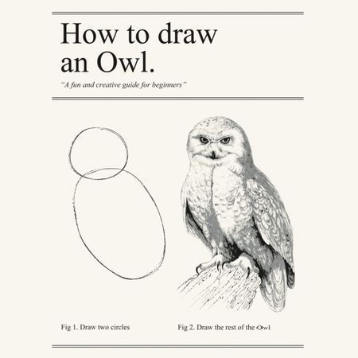

---
output:
  revealjs::revealjs_presentation:
    css: www/revealjs.css
    incremental: TRUE
    reveal_options:
      slideNumber: TRUE
      previewLinks: TRUE
editor_options:
  chunk_output_type: console
---

```{r setup, echo = FALSE}
library(knitr)

opts_chunk$set(echo = FALSE)
opts_chunk$set(message = FALSE)
opts_chunk$set(warning = FALSE)
opts_chunk$set(fig.align = "center")
```

# Intro to R: A hands-on tutorial

## Day 0: Intro to statistical programming

Sarah Strochak, Kyle Ueyama, Aaron R. Williams

```{r out.width = "50%"}
knitr::include_graphics("www/images/Rlogo.png")
```

## R Lunch Lab

```{r fig.retina = 1}

```

# Statistical Programming

## Motivation: why statistical programming?

1) Clearly answer questions
2) Clearly communicate the answer to questions
3) Document the steps to answering a question

## Example 1

What is 2 + 2?

## Example 1

What is 2 + 2?

```{r, echo = TRUE}
2 + 2
```

## Example 2

What is the median price of diamonds with carat > 1 and a Good cut?

## Example 2

What is the median price of diamonds with carat > 1 and a Good cut?

```{r, echo = TRUE}
library(tidyverse)

diamonds %>%
  filter(carat > 1, cut == "Good") %>%
  summarize(median(price))
```

## Example 3

How could increasing the retirement age affect the poverty rates of Hispanic women ages 62 and older?

## Example 3

How could increasing the retirement age affect the poverty rates of Hispanic women ages 62 and older?

```{r out.width = "50%"}
knitr::include_graphics("www/images/out-of-sync.gif")
```

<small>Via [die-seite-des-dr-caligari](http://die-seite-des-dr-caligari.tumblr.com/post/102115497897)</small>

# Principles

1) accurate
2) computationally reproducible
3) can be interpreted by humans
4) portable
5) accessible
6) efficient

## 1) Accuracy


## 2) Computationally reproducible


## 3) Can be interpreted by humans


## 4) Portable


## 5) Accessible


## 6) Efficient

# A survey of other programming languages

## Stata

```{r out.width = "30%"}
knitr::include_graphics("www/images/Stata.png")
```

* Users: Economists
* Strengths: Good econometric tools
* Limitations: Proprietary, One data set at a time, Inflexible

*Photo by StataCorp LP, CC BY-SA 4.0, Unaltered*

## SAS (public domain)

```{r out.width = "30%"}
knitr::include_graphics("www/images/SAS.png")
```

* Users: Older economists
* Strengths: Doesn't use memory, 
* Limitations: Proprietary, Clunky, inflexible, and doesn't have environments, Cost, Documentation

## Matlab

```{r out.width = "30%"}
knitr::include_graphics("www/images/Matlab.png")
```

* Users: Mathematicians, Engineers
* Strengths: Matrices
* Weaknesses: Cost

## SPSS

Users
Psychologists


## Python

```{r out.width = "30%"}
knitr::include_graphics("www/images/python.png")
```

* Users: Data scientists, computer scientists
* Strengths: General purpose programming
* Weaknesses: Steep learning curve

## R

```{r out.width = "30%"}
knitr::include_graphics("www/images/Rlogo.png")
```

* Users: Data scientists, Biostatisticians
* Strengths: Extensible, Documentation, Community
* Limitations: Multiple languages in one

## Others
> * Julia
> * Rust
> * JavaScript
> * SQL

## What you use matters less than how you use it

## ~~What you use matters less than how you use it~~ R is the best

## Comparison

```{r out.width = "60%"}
knitr::include_graphics("www/images/languages.jpg")
```

# A brief history of R

## S

R is an implementation of S, a proprietary programming language created at Bell Labs in the 1970s.

## R

R is a free, open-soure programming language created by Ross Ihaka and Robert Gentleman at the Univesity of Aukland in the early 1990s.

R is mostly written in R, C, and FORTRAN.

## CRAN

The Comprehensive R Archive Network was introduced in 1997. 

## RStudio

## tidyverse

# Fundamental concepts

## Computational Reproducibility

* **Replication:** the recreation of findings across repeated studies, is a cornerstone of science. 
* **Reproducibility:** the ability to access data, source code, tools, and documentation and recreate all calculations, visualizations, and artifacts of an analysis
* *Computational reproducibility should be the minimum standard for computational social sciences and statistical programming*

## Script

* A plain text document that contains code and comments

**Map to the answer**

## Text editor/IDE


## Comments

```
# increase perc_speeding by 0.2 because of systematic underreporting
mutate(bad_drivers, perc_speeding = perc_speeding * 1.2)
```

* Clear code avoids the need for describing "what"
* Comments should focus on **"why"**


* Packages
* Coding style
* Tests
* The command line
* Data structures
* Data types
* functions/macros


* Filtering
* Summarization


# Organizing an analysis


# Ways to learn a programming language
1: use it, use it again, use it some more.

# Software check


