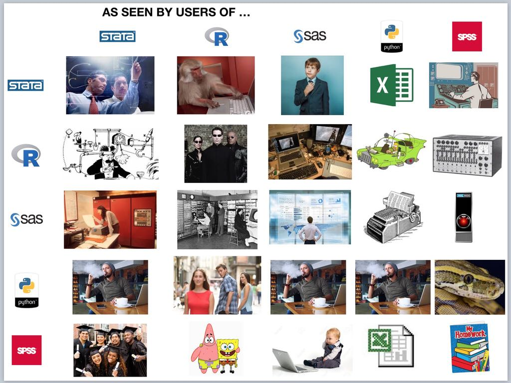

---
output:
  revealjs::revealjs_presentation:
    css: www/revealjs.css
    incremental: TRUE
    reveal_options:
      slideNumber: TRUE
      previewLinks: TRUE
editor_options:
  chunk_output_type: console
---

```{r setup, echo = FALSE}
library(knitr)

opts_chunk$set(echo = FALSE)
opts_chunk$set(message = FALSE)
opts_chunk$set(warning = FALSE)
opts_chunk$set(fig.align = "center")
```

# <font color="#ffffff">Intro to R: A hands-on tutorial</font> {data-background=#1696d2}

## Day 0: Intro to statistical programming

Sarah Strochak, Kyle Ueyama, Aaron R. Williams

```{r out.width = "50%"}
knitr::include_graphics("www/images/Rlogo.png")
```

## R Lunch Lab

```{r fig.retina = 1}

```

# <font color="#ffffff">Statistical Programming</font> {data-background=#1696d2}

## Motivation: why statistical programming?

1) Clearly answer questions
2) Clearly communicate the answer to questions
3) Document the steps to answering a question

## Example 1

What is 2 + 2?

## Example 1

What is 2 + 2?

```{r, echo = TRUE}
2 + 2
```

## Example 2

What is the median price of diamonds with carat > 1 and a Good cut?

## Example 2

What is the median price of diamonds with carat > 1 and a Good cut?

```{r, echo = TRUE}
library(tidyverse)

diamonds %>%
  filter(carat > 1, cut == "Good") %>%
  summarize(median(price))
```

## Example 3

How could increasing the retirement age affect the poverty rates of Hispanic women ages 62 and older?

## Example 3

How could increasing the retirement age affect the poverty rates of Hispanic women ages 62 and older?

```{r out.width = "50%"}
knitr::include_graphics("www/images/out-of-sync.gif")
```

<small>Via [die-seite-des-dr-caligari](http://die-seite-des-dr-caligari.tumblr.com/post/102115497897)</small>

# <font color="#ffffff">Principles</font> {data-background=#1696d2}

## Principles

1) Accuracy
2) Computational reproducibility
3) Human interpretability
4) Portability
5) Accessibility
6) Efficiency

## 1) Accuracy

Deliberate steps **should** be taken to minimize the chance of making an error and maximize the chance of catching errors when errors inevitably occur. 

## 2) computational reproducibility

Computational reproducibility **should** be embraced to improve accuracy, promote transparency, and prove the quality of analytical work. 

## 3) Human interpretability

Code **should** be written so humans can easily understand what’s happening—even if it occasionally sacrifices machine performance.

## 4) Portability

Analyses **should** be designed so strangers can understand each and every step without additional instruction or inquiry from the original analyst. 

## 5) Accessibility

Research and data are non-rival and non-exclusive. They are public goods that **should** be widely and easily shared. Decisions about tools, methods, data, and language during the research process **should** be made in ways that promote the ability of anyone and everyone to access an analysis. 

## 6) Efficiency

Analysts **should** seek to make all parts of the research process more efficient with clear communication, by adopting best practices, and by managing computation. 

# <font color="#ffffff">A survey of other programming languages</font> {data-background=#1696d2}

## Stata

```{r out.width = "30%"}
knitr::include_graphics("www/images/Stata.png")
```

* Common users: economists, Nate Silver
* Strengths: out-of-the-box econometric tools, simple syntax
* Limitations: proprietary, one data set at a time, inflexible

*Photo by StataCorp LP, CC BY-SA 4.0, Unaltered*

## SAS

```{r out.width = "30%"}
knitr::include_graphics("www/images/SAS.png")
```

* Common users: veteran researchers, government
* Strengths: doesn't use memory
* Limitations: proprietary, expensive, clunky, inflexible, lacks environments, documentation

## Matlab

```{r out.width = "30%"}
knitr::include_graphics("www/images/Matlab.png")
```

* Common users: mathematicians, engineers
* Strengths: matrices, 3D plotting
* Weaknesses: cost, 3D plotting

## SPSS

```{r out.width = "30%"}
knitr::include_graphics("www/images/spss.png")
```

* Common users: psychologists
* Strengths: point-and-click tools
* Weaknesses: point-and-click tools, limited functionality

## Python

```{r out.width = "30%"}
knitr::include_graphics("www/images/python.png")
```

* Users: data scientists, computer scientists
* Strengths: general purpose programming, extensibility, flexibility
* Weaknesses: steep learning curve

## R

```{r out.width = "30%"}
knitr::include_graphics("www/images/Rlogo.png")
```

* Users: statisticians, data scientists, biostatisticians
* Strengths: extensible, documentation, community
* Limitations: multiple languages in one

## Others
> * Julia
> * Rust
> * JavaScript
> * SQL

## What you use matters less than how you use it

## ~~What you use matters less than how you use it~~ R is the best

## Comparison

```{r out.width = "60%"}

```

*Source is unknown*

# <font color="#ffffff">A brief history of R</font> {data-background=#1696d2}

## S

R is an implementation of the S programming language, which was created at Bell Labs in the 1970s.

S-PLUS is a proprietary implementation of R that was common for years.

## R

R is a free, open-soure programming language created by Ross Ihaka and Robert Gentleman at the Univesity of Aukland in the early 1990s.

R is mostly written in R, C, and FORTRAN.

## CRAN

The Comprehensive R Archive Network was introduced in 1997. 

Repository of popular R packages with basic standards and quality control. 

## tidyverse {data-background=#fdeba4}

```{r out.width = "30%"}
knitr::include_graphics("www/images/tidyverse.png")
```

Comprehensive set of tools for data science

Core: ggplot2, dplyr, tidyr, readr, purrr, tibble, stringr, forcats

## tidyverse {data-background=#fdeba4}

```{r out.width = "30%"}
knitr::include_graphics("www/images/r4ds.png")
```

[Free text](https://r4ds.had.co.nz/) by Hadley Wickham and Garrett Grolemund

## RStudio

```{r out.width = "30%"}
knitr::include_graphics("www/images/rstudio.svg")
```

IDE and for-profit company that funded and professionalized R development

# <font color="#ffffff">Fundamental concepts</font> {data-background=#1696d2}

## Text editor/IDE

```{r out.width = "60%"}

```

* R == free, open source programming language
* RStudio == for-profit company and Itegrated Development Environment (IDE)

## The R console

```{r out.width = "60%"}

```

## Computational Reproducibility

* **Replication:** the recreation of findings across repeated studies, is a cornerstone of science. 
* **Reproducibility:** the ability to access data, source code, tools, and documentation and recreate all calculations, visualizations, and artifacts of an analysis
* *Computational reproducibility should be the minimum standard for computational social sciences and statistical programming*

## Script

```{r out.width = "60%"}
knitr::include_graphics("www/images/rstudio-script.png")
```

* A plain text document that contains code and comments
* **Map to the answer**
* `.R` and `.Rmd`

## Comments

```{r echo = TRUE, eval = FALSE}
# fivethirtyeight contains bad_drivers
library(fivethirtyeight)

# increase perc_speeding because of systematic underreporting
mutate(bad_drivers, perc_speeding = perc_speeding * 1.2)
```

* Clear code avoids the need for describing **<font color="#1696d2">"what"</font>**
* Comments should focus on **<font color="#1696d2">"why"</font>**

## Coding style

*"Good coding style is like correct punctuation: you can manage without it, butitsuremakesthingseasiertoread."* ~ Hadley Wickham

* CamelCase
* camelCase
* snake_case

[tidyverse style guide](https://style.tidyverse.org/)

## R Packages

Collections of R, C, C++, and FORTRAN code that expand the functionality of R. 

```{r out.width = "60%"}
knitr::include_graphics("www/images/urbnmapr.png")
```

## Tests

## Data structures

* scalars (do not exist in R)
* vectors
* matrices
* data frames, multidimensional arrays

## Data types

character

numeric

logical

factor

## functions/macros


## Filtering
## Summarization

# <font color="#ffffff">Organizing an analysis</font> {data-background=#1696d2}


# <font color="#ffffff">Ways to learn a programming language</font> {data-background=#1696d2}

1: use it, use it again, use it some more.

# <font color="#ffffff">Software check</font> {data-background=#1696d2}


