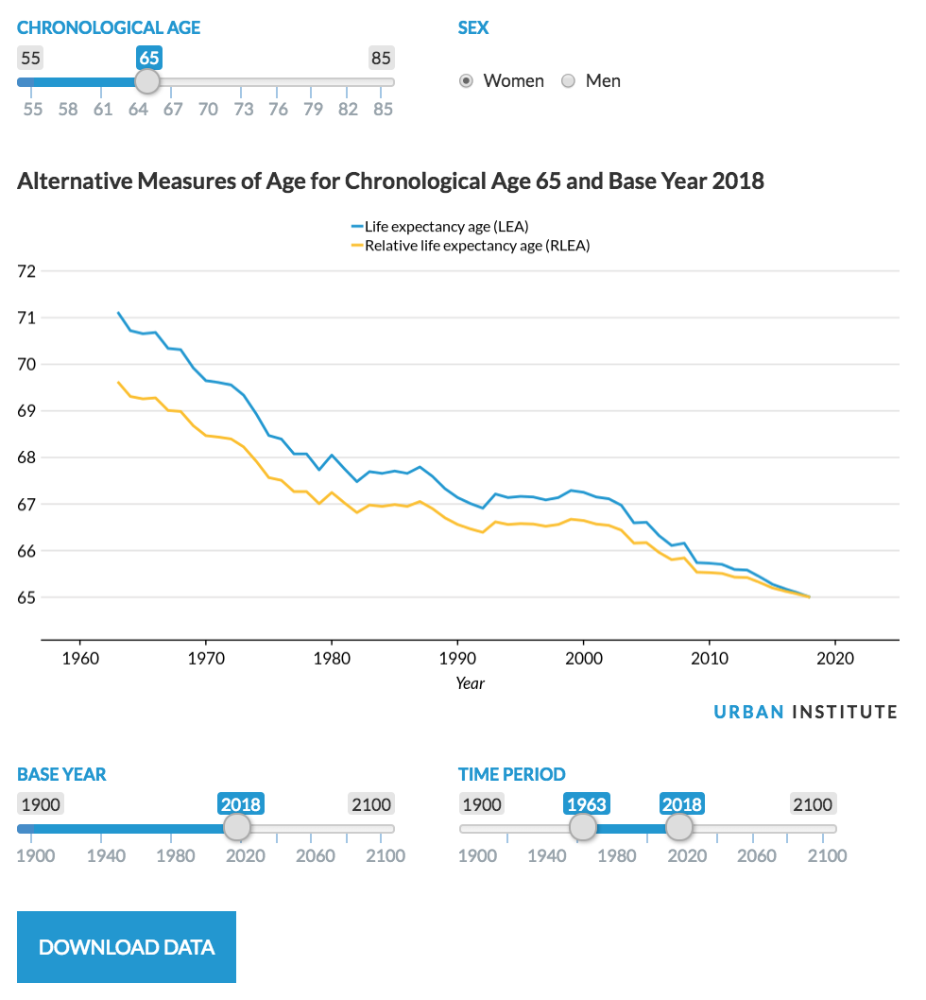
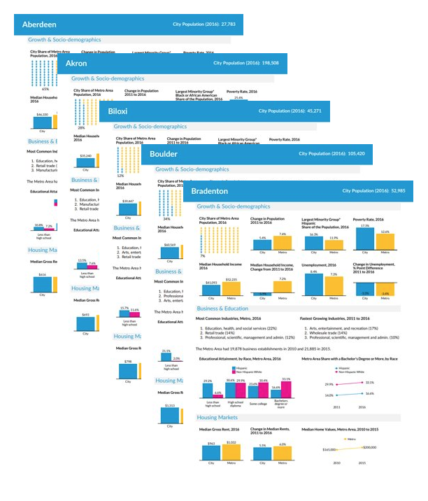
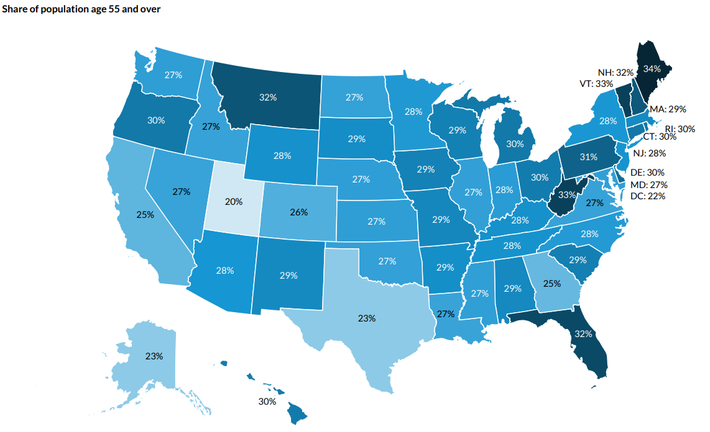
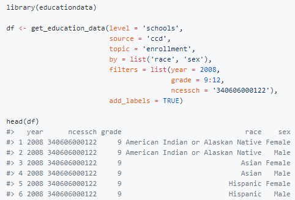
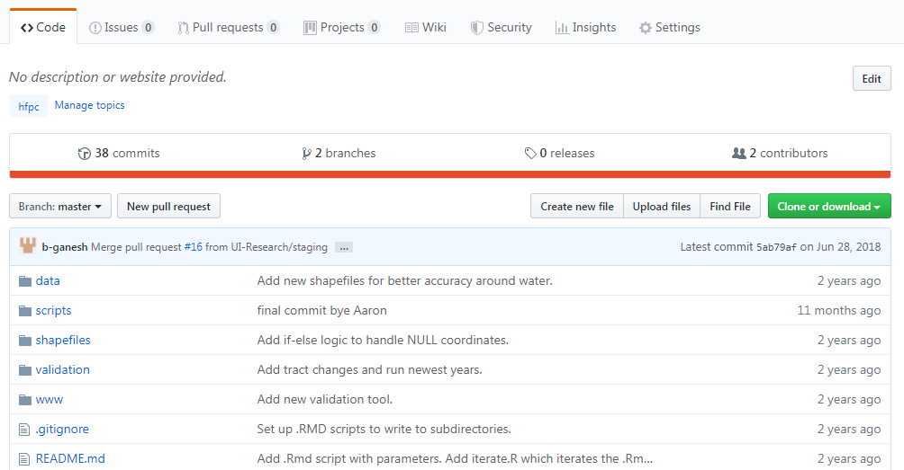
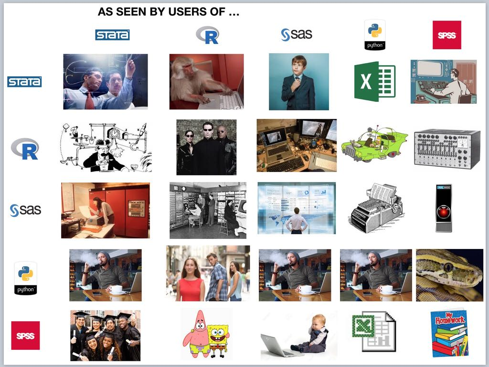

---
output:
  revealjs::revealjs_presentation:
    css: www/revealjs.css
    incremental: TRUE
    reveal_options:
      slideNumber: TRUE
      previewLinks: TRUE
editor_options:
  chunk_output_type: console
---

```{r setup, echo = FALSE, warning = FALSE, message = FALSE}
library(knitr)

opts_chunk$set(echo = FALSE)
opts_chunk$set(message = FALSE)
opts_chunk$set(warning = FALSE)
opts_chunk$set(fig.align = "center")
```

# <font color="#ffffff">Intro to R: A hands-on tutorial</font> {data-background=#1696d2}

## Day 0: Intro to statistical programming

Ajjit Narayanan, Fay Walker, Aaron R. Williams

```{r out.width = "50%"}
knitr::include_graphics(here::here("www", "images/Rlogo.png"))
```

## Advertisement

* [Join the R Users Group email list](https://urbaninstitute.github.io/r-at-urban/)
* Join the #r-users-group Slack channel

# <font color="#ffffff">Statistical Programming</font> {data-background=#1696d2}

## Motivation: why statistical programming?

1) Clearly answer questions
2) Clearly communicate the answer to questions
3) Document the steps to answering questions

## Example 1

What is 2 + 2?

## Example 1

What is 2 + 2?

```{r, echo = TRUE}
2 + 2
```

## Example 2

What is the median diamond price with carat > 1 and a "Good" cut?

## Example 2

What is the median price of diamonds with carat > 1 and a Good cut?

```{r, echo = TRUE}
library(tidyverse)

diamonds %>%
  filter(carat > 1, cut == "Good") %>%
  summarize(median(price))
```

## Example 3

How could increasing the retirement age affect the poverty rates of Hispanic women ages 62 and older?

## Example 3

How could increasing the retirement age affect the poverty rates of Hispanic women ages 62 and older?

```{r out.width = "50%"}

```

<small>Via [die-seite-des-dr-caligari](http://die-seite-des-dr-caligari.tumblr.com/post/102115497897)</small>

# <font color="#ffffff">Do cool stuff</font> {data-background=#1696d2}

## R Shiny

```{r out.width = "50%"}

```

## Fact sheets

```{r out.width = "50%"}

```

## Fact sheets

```{r out.width = "50%"}
include_graphics("www/images/factsheet_template.png")
```

## urbnmapr

```{r out.width = "50%"}

```

## urbnmapr

```{r out.width = "100%"}

```

## urbnthemes

<iframe width="2000" height="600" src="https://UrbanInstitute.github.io/r-at-urban/graphics-guide.html"></iframe>

## R packages

```{r out.width = "50%"}

```

# <font color="#ffffff">Six principles</font> {data-background=#1696d2}

## 1) Accuracy

Deliberate steps **should** be taken to minimize the chance of making an error and maximize the chance of catching errors when errors inevitably occur. 

## 2) Computational reproducibility

Computational reproducibility **should** be embraced to improve accuracy, promote transparency, and prove the quality of analytic work. 

## Computational reproducibility

* <font color="#1696d2">Replication:</font> the recreation of findings across repeated studies, is a cornerstone of science
* <font color="#1696d2">Reproducibility:</font> the ability to access data, source code, tools, and documentation and recreate all calculations, visualizations, and artifacts of an analysis

* *Computational reproducibility should be the minimum standard for computational social sciences and statistical programming*

## 3) Human interpretability

Code **should** be written so humans can easily understand what’s happening—even if it occasionally sacrifices machine performance.

## 4) Portability

Analyses **should** be designed so strangers can understand each and every step without additional instruction or inquiry from the original analyst. 

## 5) Accessibility

Research and data are non-rivalrous and can be non-excludable. They are public goods that **should** be widely and easily shared. Decisions about tools, methods, data, and language during the research process **should** be made in ways that promote the ability of anyone and everyone to access an analysis. 

## 6) Efficiency

Analysts **should** seek to make all parts of the research process more efficient with clear communication, by adopting best practices, and by managing computation. 

## Principles

> 1) Accuracy
> 2) Computational reproducibility
> 3) Human interpretability
> 4) Portability
> 5) Accessibility
> 6) Efficiency

# <font color="#ffffff">Fundamental concepts</font> {data-background=#1696d2}

## Text editor/IDE

```{r out.width = "60%"}
knitr::include_graphics("www/images/rstudio.png")
```

* R <- free, open source programming language
* RStudio <- for-profit company and Itegrated Development Environment (IDE)

## RStudio

```{r out.width = "30%"}
knitr::include_graphics("www/images/rstudio.svg")
```

## The R console

```{r out.width = "60%"}
knitr::include_graphics("www/images/rstudio-console.png")
```

## Script

```{r out.width = "60%"}
knitr::include_graphics("www/images/rstudio-script.png")
```

* A plain text document that contains code and comments
* **Map to the answer**
* `.R` and `.Rmd`

## Comments

```{r echo = TRUE, eval = FALSE}
# fivethirtyeight contains bad_drivers
library(fivethirtyeight)

# increase perc_speeding because of systematic underreporting
mutate(bad_drivers, perc_speeding = perc_speeding * 1.2)
```

* Clear code avoids the need for describing **<font color="#1696d2">"what"</font>**
* Comments should focus on **<font color="#1696d2">"why"</font>**

## Coding style

*"Good coding style is like correct punctuation: you can manage without it, butitsuremakesthingseasiertoread."* ~ Hadley Wickham

* CamelCase
* camelCase
* snake_case

[tidyverse style guide](https://style.tidyverse.org/)

## R Packages

Collections of R, C, C++, and FORTRAN code that expand the functionality of R. 

```{r out.width = "40%"}

```

## Comprehensive R Archive Network

* CRAN was introduced in 1997. 
* Repository of popular R packages with basic standards and quality control. 

## tidyverse {data-background=#fdeba4}

```{r out.width = "30%"}
knitr::include_graphics("www/images/tidyverse.png")
```

Comprehensive set of tools for data science

Core: ggplot2, dplyr, tidyr, readr, purrr, tibble, stringr, forcats

## tidyverse {data-background=#fdeba4}

```{r out.width = "30%"}
knitr::include_graphics("www/images/r4ds.png")
```

[Free text](https://r4ds.had.co.nz/) by Hadley Wickham and Garrett Grolemund

## Installing and loading packages

```{r eval = FALSE, echo = TRUE}
# run only once ever(ish) and don't include in scripts
install.packages("tidyverse")
```

```{r eval = FALSE, echo = TRUE}
# include at the top of scripts and run once per session
library(tidyverse)
```

## Data structures

<font color="#1696d2">Scalars (do not exist in R)</font>

<font color="#1696d2">Vectors</font>
```{r eval = TRUE, echo = FALSE}
c(1, 2, 3, 4, 5)
```

<font color="#1696d2">Matrices</font>

```{r eval = TRUE, echo = FALSE}
matrix(c(1:2, 3:4, 5:6), nrow = 2)
```

<font color="#1696d2">Data frames, multidimensional arrays</font>

```{r eval = TRUE, echo = FALSE}
msleep %>%
  select(name, awake, brainwt, bodywt) %>%
  head(n = 4)
```

## Data types

<font color="#1696d2">Character</font>

```{r eval = TRUE, echo = FALSE}
c("a", "b", "c", "d", "e")
```

<font color="#1696d2">Numeric</font>

```{r eval = TRUE, echo = FALSE}
c(1, 2, 3, 4, 5)
```

<font color="#1696d2">Logical</font>

```{r eval = TRUE, echo = FALSE}
c(TRUE, TRUE, FALSE, TRUE, FALSE)
```

<font color="#1696d2">Factor</font>

```{r eval = TRUE, echo = FALSE}
factor(c("good", "ok", "bad", "ok", "ok"), levels = c("good", "ok", "bad"))
```

## Missing values

* `NA` is R's encoding for missing values 
* Missing values are contagious

```{r echo = TRUE}
mean(c(1, 2, 3, 4, NA))
```

## Assignment

R can hold many different objects at the same time. Storing the consequence of code requires assignment (`<-`).

```{r echo = TRUE}
a <- 2
b <- 2

a + b

c <- a + b
c
```

## Functions

Arguments by position

```{r echo = TRUE}
mean(c(1, 2, 3, 4, NA), 0.2, TRUE)
```

Arguments by name

```{r echo = TRUE}
mean(x = c(1, 2, 3, 4, NA), trim = 0.2, na.rm = TRUE)
```

Function documentation

`?mean`

## Custom functions

Rule of three: never program something three or more times

```{r echo = TRUE}
test_oddness <- function(x) {
  ifelse(test = x %% 2 == 0, yes = "even!", no = "odd!")
}

test_oddness(1:10)
```

## Tests

What will it take to convince you that your code is correct?

1) Assign monthly observations to fiscal years
  * <font color="#1696d2">Are there 12 months per year?</font>
2) Link observations from 2017 to observations from 2018.
  * <font color="#1696d2">Do non-matching variables that shouldn't change change?</font>
3) Tax calculator
  * <font color="#1696d2">Are values that must be positive non-positive?</font>

## Tests tips

1) Write the test first!
2) Each time you encounter a bug, write a test that will convince you the bug no longer exists.

# <font color="#ffffff">Organizing an analysis</font> {data-background=#1696d2}

## 1) Keep things together

* If possible, store data, scripts, and outputs in the same place.
* Sort document data, scripts, and outputs into sub directories with names like `data/`, `scripts/`, and `outputs/`

```{r out.width = "80%"}

```

## 2) File paths

* File paths are programmatic references to the locations of files on a computer. 
* RStudio accepts `/` regardless of operating system. 
* Example: `r getwd()`

## 3) Working directories

* Code needs to be portable!
  * Use relative file paths
* Programmers can use `setwd()` to shortcut much of absolute file paths
* `.Rproj` are a superior solution only available in R
  * Never use `setwd()` in R

# <font color="#ffffff">Ways to learn a programming language</font> {data-background=#1696d2}

## Tips

1) Read R4DS
2) Attend the rest of this training
3) Find a project ASAP
4) Connect with the community
5) Use R, use it again, and then use R some more

## Schedule

# <font color="#ffffff">Software check</font> {data-background=#1696d2}

## Check R

1) Open RStudio
2) Submit `sessionInfo()`
3) Is R Version > 3.6.0?

## Check RStudio

1) In RStudio, click Help > About RStudio
2) Is the version > 1.0.0

## Install the tidyverse

1) Submit `install.packages("tidyverse")` to the console
2) Run `library(tidyverse)`


# <font color="#ffffff">A survey of other programming languages</font> {data-background=#1696d2}

## Stata

```{r out.width = "30%"}
knitr::include_graphics("www/images/Stata.png")
```

* Common users: economists, Nate Silver
* Strengths: out-of-the-box econometric tools, simple syntax
* Limitations: proprietary, one data set at a time, inflexible

*Photo by StataCorp LP, CC BY-SA 4.0, Unaltered*

## SAS

```{r out.width = "30%"}
knitr::include_graphics("www/images/SAS.png")
```

* Common users: veteran researchers, government
* Strengths: doesn't use memory
* Limitations: proprietary, expensive, clunky, inflexible, lacks environments, documentation

## Python

```{r out.width = "30%"}
knitr::include_graphics("www/images/python.png")
```

* Users: data scientists, computer scientists
* Strengths: general purpose programming, extensibility, flexibility
* Weaknesses: steep learning curve

## R

```{r out.width = "30%"}
knitr::include_graphics("www/images/Rlogo.png")
```

* Users: statisticians, data scientists, biostatisticians
* Strengths: extensible, documentation, community, many objects at once
* Limitations: multiple languages in one

## Others
> * SPSS
> * Matlab
> * Julia
> * Rust
> * JavaScript
> * SQL

## What you use matters less than how you use it

## ~~What you use matters less than how you use it~~ R is the best

## Comparison

```{r out.width = "60%"}

```

*Source is unknown*

