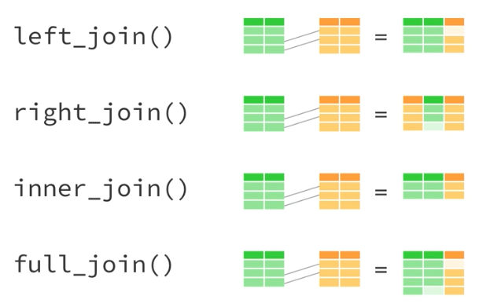

<style>
@import url('https://fonts.googleapis.com/css?family=Lato&display=swap');
</style>

<link href="https://fonts.googleapis.com/css?family=Lato&display=swap" rel="stylesheet">

# Review
* `%>%`: The pipe operator
* `dplyr` verbs for data manipulation
  * `select()`
  * `filter()`
  * `rename()`
  * `arrange()`
  * `mutate()`
  * `summarize()`
  * `group_by()`

```{r echo = FALSE, message = FALSE, warning = FALSE}
library(tidyverse)
```

# Motivation

* Review and master `library(dplyr)`
* Expand our skill set so we can do more types of analysis

### Exercise 0

<font color="#55b748">**Step 1:**</font> Open up your `.Rproj` for `urbn101`. You should now see `urbn101` in the top right of RStudio instead of “Project: (None)” . 

<font color="#55b748">**Step 2:**</font> Install the R package `nycflights13`. 

<font color="#55b748">**Step 3:**</font> Load `tidyverse` and `nycflights13` at the top of your script. 

<font color="#55b748">**Step 4:**</font> Run `data(flights)` in the console to load the flights data set into your R environment. Also run `data(planes)` to load the planes data set. 

<font color="#55b748">**Step 5:**</font> Look at the `flights` data set (how many ways can you do this?)


## Conditional transformation
Last week, we showed how `mutate()` can be used to create new variables or to transform new variables. For example, we converted knots into miles per hour. We also learned about `if_else` last week which works great for one condition. But what if you have multiple conditions? `case_when()` allows for a sequence of conditional logic that can be used to transform or create variables with `mutate()`. For example, here I create a variable called `lateness` that creates a character variable with the levels `"very late"`, `"late"`, and `"on time"`. The logic is evaluated from top to bottom and `TRUE` is used to refer to all other remaining cases.

The syntax may look a little weird at first but it's easy to pick up! The logical condition goes to the left of `~` and the output results goes to the right. `&` and `|` can be used to combine logical statements. 

```{r eval = FALSE}
flights %>%
  mutate(
    lateness = case_when(
      arr_delay > 30 ~ "very late",
      arr_delay > 0 ~ "late",
      TRUE          ~ "on time"
    )
  )

```

## Strings

`library(stringr)` contains powerful and concise functions manipulating character variables. Reference the [cheat sheet](https://github.com/rstudio/cheatsheets/blob/master/strings.pdf) for an overview of the different string maniuplation functions.

### Exercise 1

The `month` and `day` columns are currently integer variables. We want to turn them into character variables with leading zeros. For example, `1` should be `"01"`.


<font color="#55b748">**Step 1:**</font> Use `mutate()` to overwrite `month` and `day` with `str_pad()`. The first argument should be `month` or `day`. The second argument, `width`, should be `2`. 

<font color="#55b748">**Step 2:**</font> The padding character is currently a space, but we want it to be `"0"`. Use `?str_pad` to figure out how to switch the padding character. 

<font color="#55b748">**Step 3:**</font> Pipe the result into the following line `mutate(flight_date = paste(year, month, day, sep = "-"))`

<font color="#55b748">**Step 4:**</font> Drop all variables except `flight_date`, `distance`, and `air_time`. 

<font color="#55b748">**Step 5:**</font> Assign the result to `flights_subset`. 

## Dates

`library(lubridate)` contains powerful and concise functions for creating and manipulating dates, times, and date-times. It is aware of leap days and leap seconds and is useful for calculating periods, durations, intervals, and more. 

### Exercise 2

<font color="#55b748">**Step 1:**</font> Add `library(lubridate)` after `library(nycflight13)` in your script. 

<font color="#55b748">**Step 2:**</font> `library(lubridate)` is powerful but it needs variables in the correct format. Use `ymd()` inside of `mutate()` to turn the `flight_date` variable into a date rather than a character vector.   

<font color="#55b748">**Step 3:**</font> Inside the previous `mutate` statement, add another column called `weekday` for the weekday of the flight. You can use `wday(flight_date)` to find the day of the week for each date.

<font color="#55b748">**Step 4:**</font> Assign the result to `flights_subset`. 

<font color="#55b748">**Step 5:**</font> Use `count()` to count the number of flights by day of the week. 

## `group_by` and `summarize()`

This is often the hardest concept to fully grasp, but it's also the most powerful!
{width=70%}


### Exercise 3

We are going to summarize `flights_subset` from the previous example by `week_day`

<font color="#55b748">**Step 1:**</font> `group_by()` `week_day` and use `n()` in `summarize()` to count the number of observations. This should match Step 5 from the previous exercise. 

<font color="#55b748">**Step 2:**</font> In the same `summarize()`, calculate `mean()`, and `max()` `distance`.

<font color="#55b748">**Step 3:**</font> In the same `summarize()`, calculate median `air_time`.

<font color="#55b748">**Step 4:**</font> Rename the resulting variables *inside* `summarize()` so they have more useful names. 


## `left_join()`

Joins are the main method for combining two datasets with a commmon key column together. There are many types of joins, and we highly recommend you read this [chapter on joins in R4DS](https://r4ds.had.co.nz/relational-data.html) if you want more info. Below is a quick visual summary of the types of joins you can perform in R.
{width=60%}

For now we will focus on the "left" join, which merges observations from the right data set to the left data set. This is the join type I use 90% of the time in R. Below is an example of how the `left_join()` function works.

```{r}
people <- tribble(
  ~name, ~team, 
  "Aaron", "Pacers",
  "Kyle", "Wizards",
  "Ajjit", "Warriors",
  "Fay", "Wizards"
)

team_locations <- tribble(
  ~team, ~city,
  "Warriors", "Oakland",
  "Pacers", "Indianoplis",
  "Wizards", "Washington DC"
)

left_join(x = people, y = team_locations, by = "team")

```

### Exercise 4

`flights` contains information about flights and the unit of observation is airplane flights. `planes` contains information about the airplanes and the unit of observation is the airplane. The common column between these tables is the `tailnum` column.

We want to add information about planes to the flights data set. This is a left join because for every flight in the dataset, we want to append flight information. This is also called a many-to-one join because we are joining many rows from the `flights` data to one row from the `planes` data.  

<font color="#55b748">**Step 1:**</font> Use `left_join()` to join `planes` to `flights`. The common key is `tailnum`. 

<font color="#55b748">**Step 2:**</font> Use `anti_join()` to see observations from `flights` that don't have a match in `planes` and call the output object `unmatched_flights`. The common key is `tailnum`. 

<font color="#55b748">**Step 2:**</font> Use `slice()` to extract the `tailnum` value in the first row of `unmatched_flights`. Call this variable `first_unmatched_tailnum` 

<font color="#55b748">**Step 3:**</font> Use `filter()` to see if `first_unmatched_tailnum` is in `planes`. Hint: it shouldn't be!


# Custom functions

Sometimes functions don't exist for desired calculations or we want to combine many calculations into one function to reduce copying-and-pasting. 

"You should consider writing a function whenever you’ve copied and pasted a block of code more than twice (i.e. you now have three copies of the same code)." ~ [R4DS](https://r4ds.had.co.nz/functions.html#when-should-you-write-a-function)

R has a flexible function system that makes it very easy to define custom functions!

```
function_name <- function(arg1, arg2 = default) {
  # function body
}
```

Three ingredients

* Function name - usually verbs
* Function arguments - inputs to the function (optional)
* Function body


```{r}
square <- function(x = 2) {
  x ^ 2
}

square()

square(x = 4)
```

**Note:** Using tidyverse functions inside of custom functions often requires non-standard evaluation. Please reach out for help when this is your goal.

### Exercise 5

<font color="#55b748">**Step 1:**</font> Write a function called `multiply_xy()` that takes arguments `x` and `y` and multiplies them together. 

<font color="#55b748">**Step 2:**</font> Add your favorite number as the default for `x` and your least favorite number as the default for `y`.

<font color="#55b748">**Step 3:**</font> Call the function and overwrite the default for `y` with your favorite number.


# System functions

R contains a full set of functions for managing files and folders on your computer 

* `file.create()`
* `file.exists()`
* `file.remove()`
* `file.rename()`
* `file.copy()`
* `dir.create()`


What do you think this below chunk of code is doing in plain English?

```
if (!file.exists("data/cps.csv")) {
  download.file("https//:cps-download.gov", "data/cps.csv")
}
```

### Exercise 6

<font color="#55b748">**Step 1:**</font> Check to see if you are in an R project. Use `dir.create()` to create a folder called `final-data/`.  

<font color="#55b748">**Step 1:**</font> Use `file.copy()` to duplicate your script and then delete the copy with `file.remove()`. CAREFUL! There is no undo button!

# Conditional logic

Conditional logic is an important concept in computer programming. We already used `ifelse()` and `case_when()` to create indicator variables and conditional variables. Sometimes it's also useful to run entire chunks of code conditionally.

```
if () {

} else if () {

} else {

}
```

Three ingredients

* Conditional predicate (`if`, `else if`, `else`)
* Conditional statement (`==`, `>`, `<`, `%in%`)
* Code body

### Example

```{r}
x <- 1000

if (x > 999) {
  print("x is big")
} else {
  print("x is small")
}
```


# Resources

* [R4DS: functions](https://r4ds.had.co.nz/functions.html)
* `stringr` [cheat sheet](https://github.com/rstudio/cheatsheets/raw/master/strings.pdf)
